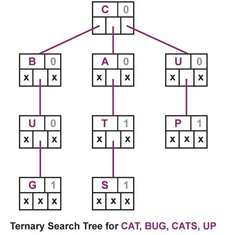

```{r, echo = FALSE, message = FALSE}
knitr::opts_chunk$set(collapse = T, comment = "#>")
options(TSTr.print_min = 4L, TSTr.print_max = 4L)
library(TSTr)
```


A __ternary search tree__ is a type of trie (sometimes called a prefix tree) where nodes are arranged in a manner similar to a binary search tree, but with up to three children rather than the binary tree's limit of two. Like other prefix trees, a ternary search tree can be used as an associative map structure with the ability for incremental string search.

### Description

Each node of a ternary search tree stores a single character, an indicator and pointers to its three children conventionally named equal kid, lo kid and hi kid, which can also be referred respectively as middle (child), lower (child) and higher (child). The lists of class `tstTree` created in the package name this objects as:

* character = $ch

* indicator = $flag

* middle child = $C

* lower child = $L

* higher child = $R

The indicator marks whether or not the node is the end of a word.  The lo kid pointer must point to a node whose character value is less than the current node. The hi kid pointer must point to a node whose character is greater than the current node. The equal kid points to the next character in the word. The figure below shows a ternary search tree with the strings "cat", "bug", "cats" and "up":



As with other trie data structures, each node in a ternary search tree represents a prefix of the stored strings. All strings in the middle subtree of a node start with that prefix.

One of the advantage of using ternary search trees over tries is that ternary search trees are a more space efficient (involve only three pointers per node as compared to 26 in standard tries). Further, ternary search trees can be used any time a hashtable would be used to store strings. Ternary search trees are efficient to use(in terms of space) when the strings to be stored share a common prefix.

Searches in a ternary search tree are more efficient when the strings inserted are shuffled (not in alphabetical order).

### Functions

The function `newTree()` creates a new object of class `tstTree`. Takes as input a character vector or a file (.txt or .csv) with the strings to construct the tree, were each character will be a node. After processing all strings, it reports the total number of words and nodes in the tree.

```{r}
# Create a tree with the names of the US states
states <- sample(state.name)
stateTree <- newTree(states)

str(stateTree)
```


The created tree can then be updated with more words with the function `updateTree()` to add a batch of words or with `addWord()` to add a single string. The name of the tree to be modified must be passed as an argument to both functions. `updateTree` also reports the number of strings added and the total number of nodes in the modified tree.

Use `dimTree()` with a `tstTree` class object to know the dimensions of the tree. It returns a numeric vector where the first number is the total number of strings and the second is the total number of nodes.

```{r}
# Add some Canada regions to the previous stateTree
regions  <- c("Quebec", "Ontario", "Manitoba", "Saskatchewan", "Alberta", "British Columbia")
US.CanadaTree <- updateTree(stateTree, regions)

# Add one more region
US.CanadaTree <- addWord(US.CanadaTree, "Yukon")

# View the final dimensions of the tree
dimTree(US.CanadaTree)
```


To know if a particular string has been added to the tree use `searchWord()` with a `tstTree` class object and the string to look for. It returns TRUE or FALSE depending on whether or not the string is in the tree.

Another way to search for words is the `completeWord()` function. It receives as input an incomplete string and returns all strings in the tree that begins exactly with that input string.

```{r}
# Search a specific state
searchWord(US.CanadaTree, "Alabama")
searchWord(US.CanadaTree, "Baltimore")

# Complete strings: States and regions that begin with "A" and "Al"
completeWord(US.CanadaTree, "A")
completeWord(US.CanadaTree, "Al")
```


More information about ternary search trees can be found at [Wikipedia – Ternary Search Tree](https://en.wikipedia.org/wiki/Ternary_search_tree).


